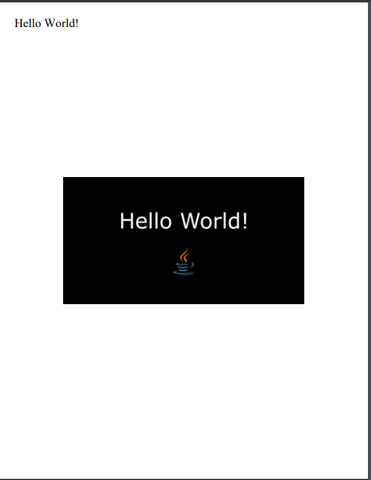

= Manipulating PDFs in Java with Apache PDFBox

== Table of Content

== Before we Start
For this paper, we will create a maven project to showcase different usages for the PDFBox library.
First set up a Java project with Maven in the IDE of your choice. To learn how to check out the  do that https://maven.apache.org/guides/getting-started/[official getting started with Maven guide].

Then we can add PDFBox to our project.
To do that, simply add the following to your Maven project's pom.xml in the *dependencies* section:

[,xml]
----
<dependency>
    <groupId>org.apache.pdfbox</groupId>
    <artifactId>pdfbox</artifactId>
    <version>2.0.27</version>
</dependency>
----

Then reload your dependencies, and you're good to go.

== First Steps

=== Blank Page
Now that we've set up our project we can start working with PDFBox. Let's start by creating an empty PDF.

First we need to create a PDFDocument, this class basically embodies an entire PDF file.

[,java]
----
// Create a new empty document
PDDocument myDocument = new PDDocument();
----

To populate our PDF with a page, we need to create one.

[,java]
----
// Create a new page without content
PDPage blankPage = new PDPage();
----

Now we need to add the page to our document.

[,java]
----
// Add the page to the document
myDocument.addPage(blankPage);
----

Finally, we need to save and close our PDF in order to actually create it.

[,java]
----
// Save the document and close it
myDocument.save("MyFirstPDF.pdf");
myDocument.close();
----

Now you should find a file called *MyFirstPDF.pdf* in the root directory of your project.
If you open it, it should only contain a single empty page.

=== Hello World
Because just creating an empty Document is pretty boring we will now create a PDF with some text and an image.

Same setup as before:

[,java]
----
// Create a new document and add a page to it
PDDocument document = new PDDocument();
PDPage page = new PDPage();
document.addPage(page);
----

To add content to our document we need a content stream, it handles placement and styling of our content. It is bound to a single page in a document.

[,java]
----
// Create a content stream
PDPageContentStream contentStream = new PDPageContentStream(document, page);
----

In order for us to write text into our document we need to first select a font.

[,java]
----
// Select a font
PDFont font = PDType1Font.TIMES_ROMAN;
----

Now we can have our content stream write `Hello World!` at the top left of the page.
The coordinate offset system of PDFBox starts at (0,0) in the *bottom* left corner of the page. The standard page size is letter, which is 612x792 pixels in PDFBox.
This means that (25, 750) is in the top left corner of the page.

[,java]
----
// Start writing
contentStream.beginText();

// Set font and size
contentStream.setFont(font, 20);

// Start writing at coordinates x = 25, y = 750
contentStream.newLineAtOffset(25, 750);

// Place text
contentStream.showText("Hello World!");

// End writing
contentStream.endText();
----

To place an image in a document the file must first be read into a PDImageXObject, which can be created from an existing file or a byte stream. To follow along replace `"path"` with the path to an image on your PC you want to place on the PDF page.

[,java]
----
// Read an image
PDImageXObject image = PDImageXObject.createFromFile("path", document);
----

To center our image we can subtract its dimensions from those of the page and dividing them by 2. We can access them by calling `page.getMediaBox()` which returns us a *PDRectangle* object which is responsible for page size.

[,java]
----
// Add the image in the middle of the page
PDRectangle dimensions = page.getMediaBox();
contentStream.drawImage(image, (dimensions.getWidth() - image.getWidth()) / 2, (dimensions.getHeight() - image.getHeight()) / 2);
----

Now we just need to close and save the stream and document.

[,java]
----
// Close and save the document
contentStream.close();
document.save("HelloWorldPage.pdf");
document.close();
----

This leaves us with a new PDF document called HelloWorldPage.pdf and if we open it, it should look something like this:

